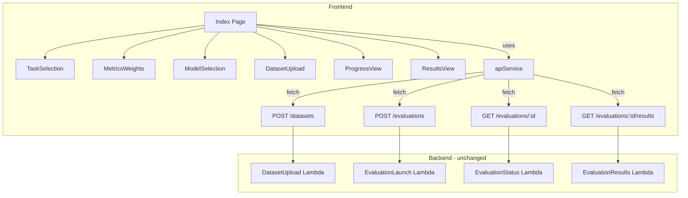
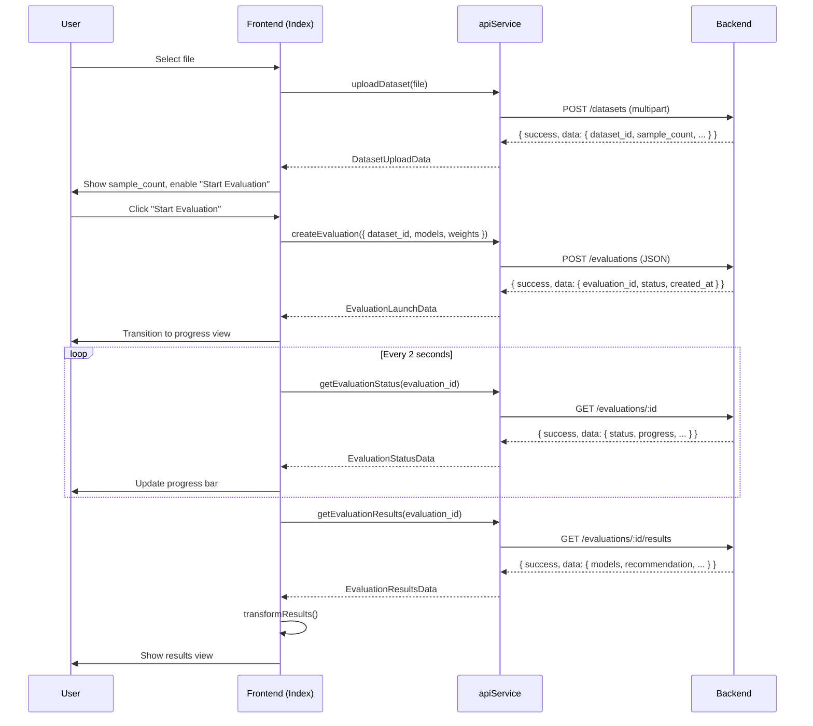

# Design Document: Frontend API Integration

## Overview

This design replaces all mock data and simulated delays in the frontend with real HTTP calls to the four existing backend endpoints. A new `apiService` module centralizes HTTP communication, and the existing wizard-flow components (`DatasetUpload`, `ProgressView`, `ResultsView`, `Index`) are rewired to consume real API responses. The hardcoded `AVAILABLE_MODELS` list is updated to the three Bedrock identifiers. No backend files are modified.

The frontend already has `@tanstack/react-query` installed but unused. This integration will leverage it for data fetching, caching, and polling — avoiding hand-rolled `useEffect` fetch logic.

## Architecture



The architecture follows a simple layered approach:

1. **API Service Layer** (`src/services/apiService.ts`) — pure functions wrapping `fetch` calls. Handles base URL resolution, timeout, Content-Type headers, and structured error throwing.
2. **React Query Hooks** (`src/hooks/useEvaluation.ts`) — thin wrappers around `apiService` functions using `useMutation` and `useQuery` from `@tanstack/react-query`. Handles polling interval, retry logic, and cache invalidation.
3. **Page/Component Layer** — existing components consume hooks instead of managing their own mock state.

### Design Decisions

- **`fetch` over `axios`**: The project has no `axios` dependency and `fetch` is sufficient for these four endpoints. Keeps the bundle small.
- **React Query for polling**: `useQuery` with `refetchInterval` provides clean polling with automatic cleanup, retry, and error state — replacing the manual `setInterval` in `ProgressView`.
- **Multipart upload for datasets**: The backend `DatasetUploadAdapter` expects `multipart/form-data` with a file part. The `apiService.uploadDataset` function will use `FormData` and let the browser set the `Content-Type` boundary automatically.
- **Weight normalization on frontend**: The UI uses 0–100 integer percentages. The API service converts these to 0–1 decimals before sending, since the backend normalizes by sum.

## Components and Interfaces

### 1. API Service (`src/services/apiService.ts`)

```typescript
// Base URL resolution
function getBaseUrl(): string;

// Structured error class
class ApiError extends Error {
  status: number;
  code: string;
  details?: Record<string, unknown>;
}

// Endpoint functions
async function uploadDataset(file: File): Promise<DatasetUploadResponse>;
async function createEvaluation(request: CreateEvaluationRequest): Promise<EvaluationLaunchResponse>;
async function getEvaluationStatus(evaluationId: string): Promise<EvaluationStatusResponse>;
async function getEvaluationResults(evaluationId: string): Promise<EvaluationResultsResponse>;
```

Each function:
- Prepends `getBaseUrl()` to the endpoint path
- Applies an `AbortController` timeout (default 30s)
- Checks `response.ok`; if false, parses the JSON error body and throws `ApiError`
- Returns the parsed JSON `data` field from the `{ success, data, error }` envelope

### 2. React Query Hooks (`src/hooks/useEvaluation.ts`)

```typescript
function useUploadDataset(): UseMutationResult<DatasetUploadData, ApiError, File>;
function useCreateEvaluation(): UseMutationResult<EvaluationLaunchData, ApiError, CreateEvaluationRequest>;
function useEvaluationStatus(evaluationId: string | null): UseQueryResult<EvaluationStatusData, ApiError>;
function useEvaluationResults(evaluationId: string | null): UseQueryResult<EvaluationResultsData, ApiError>;
```

- `useEvaluationStatus` uses `refetchInterval: 2000` and stops when status is `completed`, `failed`, or `timeout`.
- `useEvaluationResults` is enabled only when an `evaluationId` is provided and status is `completed`.
- Network retry for polling: React Query's built-in `retry: 3` handles the requirement for 3 consecutive retries on network failure.

### 3. Updated Components

**DatasetUpload** — receives `useUploadDataset` mutation. On file select, calls `mutate(file)`. Displays `isPending` as loading, `data.sample_count` on success, `error.message` on failure. Stores `data.dataset_id` via a callback to `Index`.

**Index Page** — orchestrates the full flow:
- Stores `datasetId` and `evaluationId` in state
- On "Start Evaluation": calls `createEvaluation` mutation with config + `datasetId`
- On success: stores `evaluationId`, transitions to progress phase
- Progress phase: `useEvaluationStatus(evaluationId)` drives `ProgressView`
- On `completed`: transitions to results phase, `useEvaluationResults(evaluationId)` drives `ResultsView`
- Removes `generateMockResults` entirely

**ProgressView** — props change from `{ totalRows, onComplete }` to receiving status data directly: `{ status, progress, samplesProcessed, totalSamples, currentModel }`. Removes the `useEffect` interval simulation.

**ResultsView** — adapted to accept `EvaluationResultsData` (the backend response shape) directly. Reads from `data.models` array of `BackendModelResult` and `data.recommendation` for the recommended model and reasoning. No intermediate transformation needed.

### 4. Updated Model List (`src/types/evaluation.ts`)

The `AVAILABLE_MODELS` constant is replaced with exactly three entries:

| id | name | provider | contextWindow | costPer1kTokens |
|---|---|---|---|---|
| `claude-sonnet` | Claude Sonnet | Anthropic | 200K | 0.003 |
| `claude-opus` | Claude Opus | Anthropic | 200K | 0.015 |
| `amazon-nova` | Amazon Nova | Amazon | 300K | 0.001 |

## Data Models

### Frontend Types (new/modified in `src/types/evaluation.ts`)

```typescript
// Request type for creating an evaluation
interface CreateEvaluationRequest {
  dataset_id: string;
  models: { type: 'default'; identifier: string }[];
  weights: { accuracy: number; latency: number; cost: number }; // 0-1 decimals
}

// Backend response types (matching backend models)
interface DatasetUploadData {
  dataset_id: string;
  sample_count: number;
  has_summary: boolean;
  has_class: boolean;
}

interface EvaluationLaunchData {
  evaluation_id: string;
  status: JobStatus;
  created_at: string;
}

type JobStatus = 'pending' | 'running' | 'completed' | 'failed' | 'timeout';

interface EvaluationStatusData {
  evaluation_id: string;
  status: JobStatus;
  progress: number;
  current_model?: string;
  samples_processed?: number;
  total_samples?: number;
  error_message?: string;
}

interface EvaluationResultsData {
  evaluation_id: string;
  dataset_id: string;
  models: BackendModelResult[];
  recommendation: { model_identifier: string; weighted_score: number; reasoning: string };
  weights: { accuracy: number; latency: number; cost: number };
  completed_at: string;
}

interface BackendModelResult {
  identifier: string;
  metrics: {
    accuracy?: { bleu?: number; rouge?: number; meteor?: number; bertscore?: number; geval_reasoning?: number; geval_faithfulness?: number };
    latency: { tokens_per_second: number; time_to_first_token_ms: number; total_latency_ms: number };
    cost: { total_usd: number; input_tokens: number; output_tokens: number };
  };
  status: 'completed' | 'failed';
  error_count?: number;
}
```

### Data Flow




## Error Handling

### API Service Layer

| Scenario | Behavior |
|---|---|
| Non-2xx response with JSON body | Parse `{ error: { code, message, details } }` from body, throw `ApiError(status, code, message, details)` |
| Non-2xx response with non-JSON body | Throw `ApiError(status, 'UNKNOWN_ERROR', statusText)` |
| Request timeout (30s default) | `AbortController.abort()` triggers, throw `ApiError(0, 'TIMEOUT', 'Request timed out')` |
| Network failure (fetch rejects) | Throw `ApiError(0, 'NETWORK_ERROR', error.message)` |

### Component Layer

| Component | Error Behavior |
|---|---|
| DatasetUpload | Shows error message below the drop zone. File input remains enabled for retry with a different file. |
| Index (evaluation creation) | Shows error message via toast or inline alert. Config state is preserved — user can retry without re-entering. |
| Index (polling failure) | React Query retries 3 times automatically. After 3 failures, shows connection error with a manual retry option. |
| Index (results fetch) | Shows error message with a "Retry" button that re-triggers `getEvaluationResults`. |

### Terminal Evaluation States

When polling returns `status: 'failed'` or `status: 'timeout'`:
- Polling stops (React Query's `refetchInterval` returns `false`)
- The `error_message` from the response is displayed
- A "New Evaluation" button allows the user to reset and start over
