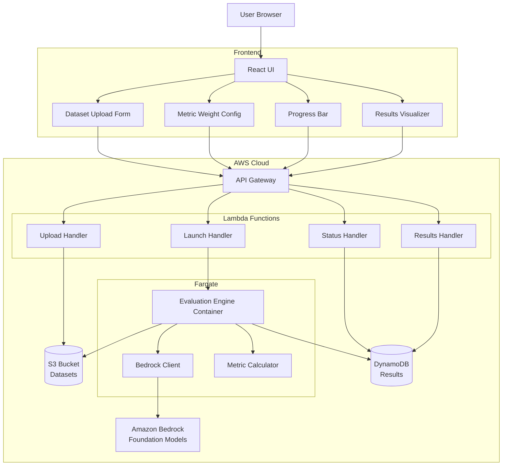
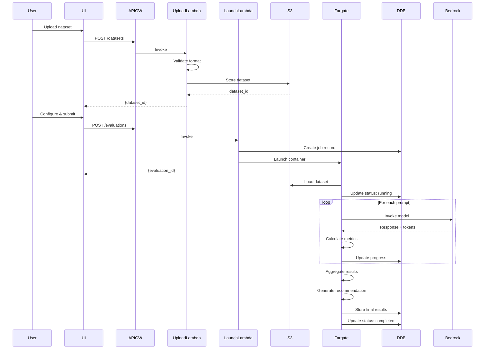
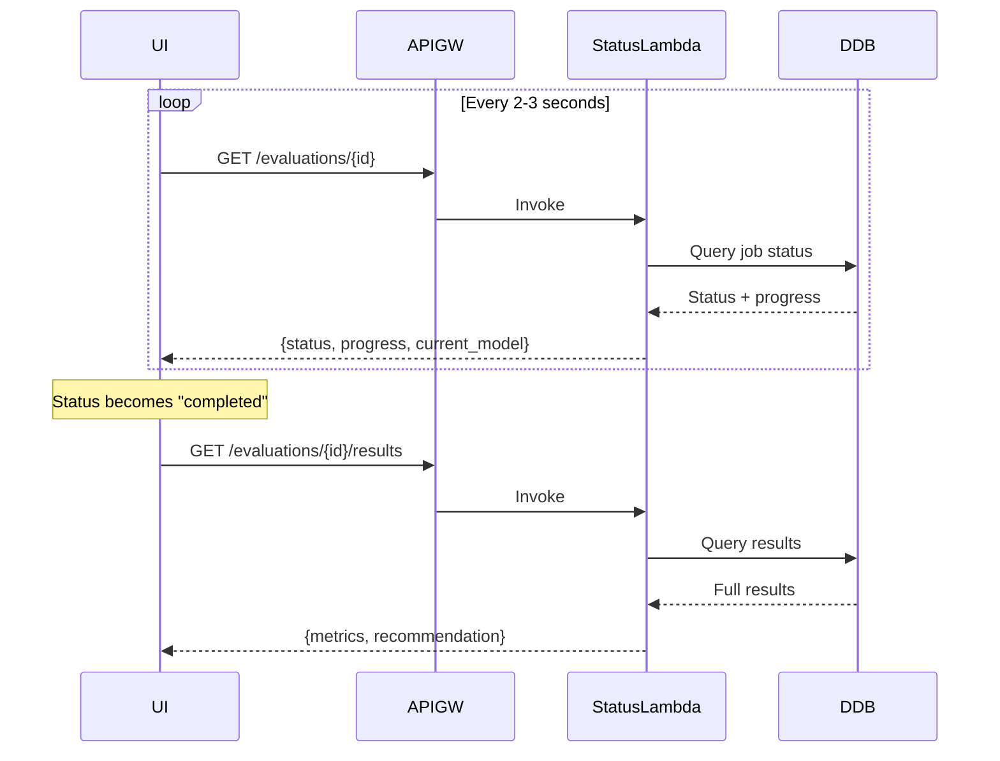

# Design Document: Model Evaluation Phase 1

## Overview

The Bedrock Model Evaluation Tool enables users to compare foundation models available through Amazon Bedrock by evaluating them across accuracy, latency, and cost metrics. This design document specifies the architecture, components, data flows, and API contracts for Phase 1 implementation.

### System Goals

- Enable both technical and non-technical users to compare LLMs for their specific use cases
- Provide quantitative metrics (accuracy, latency, cost) and visual comparisons
- Support datasets of 10-100+ samples in CSV or JSONL format
- Complete evaluations within 30 minutes for typical datasets
- Recommend the optimal model based on user-defined preferences

### Key Design Decisions

1. **Serverless Architecture**: API Gateway + Lambda + Fargate for scalability and cost efficiency
2. **Asynchronous Processing**: Long-running evaluations execute in Fargate containers while API provides status polling
3. **Hybrid Evaluation**: Combine deterministic metrics (BLEU, ROUGE), semantic metrics (BERTScore), and LLM-as-judge (G-eval) to mitigate bias
4. **Storage Strategy**: S3 for datasets (large files), DynamoDB for results (fast retrieval)
5. **Default Models**: Claude Sonnet, Claude Opus, Amazon Nova with support for custom Bedrock endpoints

## Architecture

### High-Level Architecture



### Component Responsibilities

#### Frontend (React)

- **Dataset Upload Form**: File selection, format validation, upload progress
- **Model Selection**: Default models + custom endpoint input
- **Metric Weight Configuration**: Sliders/inputs for accuracy, latency, cost weights
- **Progress Bar**: Polls GET /evaluations/{id} every 2-3 seconds
- **Results Visualizer**: Radar chart + metrics table + recommendation highlight

#### API Gateway + Lambda Handlers

- **POST /datasets**: Validate and store dataset in S3
- **POST /evaluations**: Create evaluation job, launch Fargate container
- **GET /evaluations/{id}**: Return job status and progress
- **GET /evaluations/{id}/results**: Retrieve and return evaluation results

#### Evaluation Engine (Fargate Container)

- **Dataset Loader**: Read CSV/JSONL from S3
- **Bedrock Client**: Invoke foundation models, record tokens and latency
- **Metric Calculator**: Compute accuracy (fmeval, DeepEval), latency, cost
- **Results Writer**: Store aggregated results in DynamoDB
- **Progress Updater**: Update job status throughout execution

#### Storage

- **S3**: Datasets (encrypted at rest)
- **DynamoDB**: Evaluation jobs, results, progress tracking

### Data Flow

#### Evaluation Request Flow



#### Progress Polling Flow



## Components and Interfaces

### API Contracts

#### POST /datasets

Upload and validate a dataset for evaluation.

**Request:**
```typescript
POST /datasets
Content-Type: multipart/form-data

{
  file: File // CSV or JSONL
}
```

**Response (Success):**
```typescript
{
  success: true,
  data: {
    dataset_id: string,
    sample_count: number,
    has_reference_outputs: boolean,
    has_context: boolean
  }
}
```

**Response (Error):**
```typescript
{
  success: false,
  error: {
    code: string, // "INVALID_FORMAT" | "TOO_SMALL" | "TOO_LARGE" | "MISSING_PROMPT"
    message: string,
    details?: {
      row?: number,
      line?: number,
      issue?: string
    }
  }
}
```

**Validation Rules:**
- File size: 10 bytes - 10MB
- Format: CSV or JSONL
- Required field: "prompt"
- Optional fields: "context", "reference_output"
- Minimum samples: 10
- CSV: Must have header row with "prompt" column
- JSONL: Each line must be valid JSON with "prompt" field

#### POST /evaluations

Launch an evaluation job.

**Request:**
```typescript
POST /evaluations
Content-Type: application/json

{
  dataset_id: string,
  models: Array<{
    type: "default" | "custom",
    identifier: string // "claude-sonnet" | "claude-opus" | "amazon-nova" | custom endpoint
  }>,
  weights?: {
    accuracy?: number, // 0-1, default 0.33
    latency?: number,  // 0-1, default 0.33
    cost?: number      // 0-1, default 0.34
  }
}
```

**Response:**
```typescript
{
  success: true,
  data: {
    evaluation_id: string,
    status: "pending",
    created_at: string // ISO 8601
  }
}
```

#### GET /evaluations/{id}

Get evaluation job status and progress.

**Response:**
```typescript
{
  success: true,
  data: {
    evaluation_id: string,
    status: "pending" | "running" | "completed" | "failed" | "timeout",
    progress: number, // 0-100
    current_model?: string,
    samples_processed?: number,
    total_samples?: number,
    error_message?: string
  }
}
```

#### GET /evaluations/{id}/results

Retrieve evaluation results.

**Response:**
```typescript
{
  success: true,
  data: {
    evaluation_id: string,
    dataset_id: string,
    models: Array<{
      identifier: string,
      metrics: {
        accuracy?: {
          bleu?: number,
          rouge?: number,
          meteor?: number,
          levenshtein?: number,
          bertscore?: number,
          geval_reasoning?: number,
          geval_faithfulness?: number
        },
        latency: {
          tokens_per_second: number,
          time_to_first_token_ms: number,
          total_latency_ms: number
        },
        cost: {
          total_usd: number,
          input_tokens: number,
          output_tokens: number
        }
      },
      status: "completed" | "failed",
      error_count?: number
    }>,
    recommendation: {
      model_identifier: string,
      weighted_score: number,
      reasoning: string
    },
    weights: {
      accuracy: number,
      latency: number,
      cost: number
    },
    completed_at: string
  }
}
```

### Component Interfaces

#### Dataset Uploader (TypeScript Lambda)

```typescript
interface DatasetUploader {
  validateAndStore(file: File): Promise<DatasetMetadata>;
  parseCSV(content: string): Promise<Dataset>;
  parseJSONL(content: string): Promise<Dataset>;
}

interface DatasetMetadata {
  dataset_id: string;
  sample_count: number;
  has_reference_outputs: boolean;
  has_context: boolean;
  s3_key: string;
}

interface Dataset {
  samples: Array<{
    prompt: string;
    context?: string;
    reference_output?: string;
  }>;
}
```

#### Evaluation Launcher (TypeScript Lambda)

```typescript
interface EvaluationLauncher {
  createJob(request: EvaluationRequest): Promise<EvaluationJob>;
  launchFargateContainer(job: EvaluationJob): Promise<void>;
  validateModels(models: ModelConfig[]): Promise<void>;
  normalizeWeights(weights?: WeightConfig): WeightConfig;
}

interface EvaluationRequest {
  dataset_id: string;
  models: ModelConfig[];
  weights?: WeightConfig;
}

interface ModelConfig {
  type: "default" | "custom";
  identifier: string;
}

interface WeightConfig {
  accuracy: number;
  latency: number;
  cost: number;
}

interface EvaluationJob {
  evaluation_id: string;
  dataset_id: string;
  models: ModelConfig[];
  weights: WeightConfig;
  status: JobStatus;
  created_at: string;
}

type JobStatus = "pending" | "running" | "completed" | "failed" | "timeout";
```

#### Evaluation Engine (Python Fargate Container)

```python
class EvaluationEngine:
    def run(self, job: EvaluationJob) -> None:
        """Main entry point for evaluation execution."""
        pass
    
    def load_dataset(self, dataset_id: str) -> Dataset:
        """Load dataset from S3."""
        pass
    
    def evaluate_models(self, dataset: Dataset, models: List[ModelConfig]) -> List[ModelResults]:
        """Run inference and metric calculation for all models."""
        pass
    
    def update_progress(self, evaluation_id: str, progress: int, current_model: str) -> None:
        """Update job progress in DynamoDB."""
        pass
    
    def store_results(self, evaluation_id: str, results: EvaluationResults) -> None:
        """Store final results in DynamoDB."""
        pass

class BedrockClient:
    def invoke_model(self, model_id: str, prompt: str, context: Optional[str]) -> InvocationResult:
        """Invoke a Bedrock model and record metrics."""
        pass

class MetricCalculator:
    def calculate_accuracy(self, predictions: List[str], references: List[str]) -> AccuracyMetrics:
        """Calculate all accuracy metrics using fmeval and DeepEval."""
        pass
    
    def calculate_latency(self, invocations: List[InvocationResult]) -> LatencyMetrics:
        """Calculate latency metrics from invocation results."""
        pass
    
    def calculate_cost(self, invocations: List[InvocationResult], model_id: str) -> CostMetrics:
        """Calculate cost based on token usage and Bedrock pricing."""
        pass

class ModelRecommender:
    def recommend(self, results: List[ModelResults], weights: WeightConfig) -> Recommendation:
        """Select optimal model based on weighted scoring."""
        pass
    
    def normalize_metrics(self, results: List[ModelResults]) -> List[NormalizedMetrics]:
        """Normalize all metrics to 0-1 scale."""
        pass
    
    def calculate_weighted_score(self, metrics: NormalizedMetrics, weights: WeightConfig) -> float:
        """Calculate weighted score for a model."""
        pass
```

#### Progress Tracker (TypeScript Lambda)

```typescript
interface ProgressTracker {
  getStatus(evaluation_id: string): Promise<JobStatus>;
  getResults(evaluation_id: string): Promise<EvaluationResults>;
}

interface JobStatus {
  evaluation_id: string;
  status: "pending" | "running" | "completed" | "failed" | "timeout";
  progress: number;
  current_model?: string;
  samples_processed?: number;
  total_samples?: number;
  error_message?: string;
}

interface EvaluationResults {
  evaluation_id: string;
  dataset_id: string;
  models: ModelResults[];
  recommendation: Recommendation;
  weights: WeightConfig;
  completed_at: string;
}
```

#### Results Visualizer (React Component)

```typescript
interface ResultsVisualizerProps {
  results: EvaluationResults;
}

interface ResultsVisualizer {
  renderRadarChart(models: ModelResults[]): JSX.Element;
  renderMetricsTable(models: ModelResults[]): JSX.Element;
  renderRecommendation(recommendation: Recommendation): JSX.Element;
  highlightRecommendedModel(modelId: string): void;
}
```

## Data Models

### DynamoDB Schema

#### Evaluation Jobs Table

**Table Name:** `evaluation-jobs`

**Primary Key:** `evaluation_id` (String, Partition Key)

**Attributes:**
```typescript
{
  evaluation_id: string,          // UUID
  dataset_id: string,              // S3 key reference
  models: Array<{
    type: string,
    identifier: string
  }>,
  weights: {
    accuracy: number,
    latency: number,
    cost: number
  },
  status: string,                  // "pending" | "running" | "completed" | "failed" | "timeout"
  progress: number,                // 0-100
  current_model?: string,
  samples_processed?: number,
  total_samples?: number,
  error_message?: string,
  created_at: string,              // ISO 8601
  updated_at: string,              // ISO 8601
  completed_at?: string,           // ISO 8601
  
  // Results (populated on completion)
  model_results?: Array<{
    identifier: string,
    metrics: {
      accuracy?: {
        bleu?: number,
        rouge?: number,
        meteor?: number,
        levenshtein?: number,
        bertscore?: number,
        geval_reasoning?: number,
        geval_faithfulness?: number
      },
      latency: {
        tokens_per_second: number,
        time_to_first_token_ms: number,
        total_latency_ms: number
      },
      cost: {
        total_usd: number,
        input_tokens: number,
        output_tokens: number
      }
    },
    status: string,
    error_count?: number
  }>,
  recommendation?: {
    model_identifier: string,
    weighted_score: number,
    reasoning: string
  }
}
```

**GSI:** `dataset_id-index` (for querying evaluations by dataset)

### S3 Structure

**Bucket Name:** `bedrock-eval-datasets-{account-id}-{region}`

**Key Structure:**
```
datasets/{dataset_id}.csv
datasets/{dataset_id}.jsonl
```

**Encryption:** S3 server-side encryption (SSE-S3)

### Dataset Format

#### CSV Format

```csv
prompt,context,reference_output
"What is the capital of France?","","Paris"
"Summarize this article","Article text here","Summary text"
```

**Requirements:**
- Header row required
- "prompt" column required
- "context" and "reference_output" columns optional
- UTF-8 encoding

#### JSONL Format

```jsonl
{"prompt": "What is the capital of France?", "reference_output": "Paris"}
{"prompt": "Summarize this article", "context": "Article text here", "reference_output": "Summary text"}
```

**Requirements:**
- One JSON object per line
- "prompt" field required
- "context" and "reference_output" fields optional
- UTF-8 encoding

### Bedrock Model Pricing (for cost calculation)

```typescript
const BEDROCK_PRICING = {
  "anthropic.claude-3-sonnet-20240229-v1:0": {
    input_per_1k: 0.003,
    output_per_1k: 0.015
  },
  "anthropic.claude-3-opus-20240229-v1:0": {
    input_per_1k: 0.015,
    output_per_1k: 0.075
  },
  "amazon.nova-pro-v1:0": {
    input_per_1k: 0.0008,
    output_per_1k: 0.0032
  }
  // Add more models as needed
};
```


## Correctness Properties

A property is a characteristic or behavior that should hold true across all valid executions of a system—essentially, a formal statement about what the system should do. Properties serve as the bridge between human-readable specifications and machine-verifiable correctness guarantees.

### Property 1: CSV Validation

For any CSV file, the Dataset_Uploader should validate that it contains a "prompt" column, and reject files without this required column.

**Validates: Requirements 1.1**

### Property 2: JSONL Validation

For any JSONL file, the Dataset_Uploader should validate that each line contains a "prompt" field, and reject files where any line is missing this required field.

**Validates: Requirements 1.2**

### Property 3: Dataset Upload Round-Trip

For any valid dataset, uploading it to S3 should return a dataset identifier that can be used to retrieve an equivalent dataset structure.

**Validates: Requirements 1.4**

### Property 4: Optional Field Preservation

For any dataset containing optional fields ("context" or "reference_output"), the stored version should preserve all field values exactly as provided.

**Validates: Requirements 1.5, 1.6**

### Property 5: Custom Model Acceptance

For any valid Bedrock model endpoint ID (custom or default), the API_Gateway should accept it in an evaluation request.

**Validates: Requirements 2.2**

### Property 6: Model Selection Validation

For any evaluation request, the API_Gateway should reject requests with zero models selected and accept requests with one or more models.

**Validates: Requirements 2.3**

### Property 7: Invalid Model Rejection

For any invalid Bedrock model endpoint ID, the API_Gateway should return an error message indicating the invalid identifier.

**Validates: Requirements 2.4**

### Property 8: Evaluation Job Creation Round-Trip

For any valid evaluation request, submitting it should create a job that can be retrieved using the returned evaluation identifier.

**Validates: Requirements 3.1**

### Property 9: Fargate Container Launch

For any created evaluation job, the API_Gateway should launch a Fargate container to execute the evaluation.

**Validates: Requirements 3.2**

### Property 10: Dataset Loading

For any valid dataset_id in an evaluation job, the Evaluation_Engine should successfully load the dataset from S3.

**Validates: Requirements 3.3**

### Property 11: Complete Model Invocation

For any dataset with N prompts and M selected models, the Bedrock_Client should perform exactly N × M invocations (excluding failures).

**Validates: Requirements 3.4**

### Property 12: Invocation Metrics Capture

For any model invocation result, it should contain input token count, output token count, time to first token, and total latency.

**Validates: Requirements 3.5, 5.3, 5.5**

### Property 13: Error Resilience

For any evaluation where one model invocation fails, the Evaluation_Engine should continue processing all remaining prompts and models.

**Validates: Requirements 3.6, 11.3**

### Property 14: Metrics Computation Completeness

For any completed evaluation, the results should contain accuracy (if reference outputs exist), latency, and cost metrics for each model.

**Validates: Requirements 3.7**

### Property 15: Results Storage Round-Trip

For any completed evaluation, the results stored in DynamoDB should be retrievable using the evaluation identifier.

**Validates: Requirements 3.8**

### Property 16: Accuracy Metrics Completeness

For any dataset with reference outputs, the computed accuracy metrics should include BLEU, ROUGE, METEOR, Levenshtein, BERTScore, G-eval reasoning, and G-eval faithfulness scores.

**Validates: Requirements 4.1, 4.2, 4.3, 4.4, 4.5, 4.6, 4.7**

### Property 17: Accuracy Metric Aggregation

For any set of per-sample accuracy scores, the mean score should equal the sum of scores divided by the number of samples.

**Validates: Requirements 4.9**

### Property 18: Accuracy Metrics Conditional Computation

For any dataset without reference outputs, the results should not contain deterministic or semantic accuracy metrics.

**Validates: Requirements 4.10**

### Property 19: Tokens Per Second Calculation

For any model invocation with output tokens and generation time, tokens per second should equal output_tokens divided by generation_time_seconds.

**Validates: Requirements 5.1**

### Property 20: Latency Metric Aggregation

For any set of per-invocation latency metrics (TPS, TTFT, total latency), the mean should equal the sum divided by the number of invocations.

**Validates: Requirements 5.2, 5.4, 5.6**

### Property 21: Cost Calculation Formula

For any model invocation with token counts and pricing, the cost should equal (input_tokens × input_price_per_1k / 1000) + (output_tokens × output_price_per_1k / 1000).

**Validates: Requirements 5.7**

### Property 22: Cost Aggregation

For any set of per-invocation costs, the total cost should equal the sum of all individual costs.

**Validates: Requirements 5.8**

### Property 23: Status Retrieval

For any evaluation job, querying its status should return a valid status value from the set: "pending", "running", "completed", "failed", "timeout".

**Validates: Requirements 6.1, 6.2**

### Property 24: Progress Calculation

For any running evaluation job with C completed invocations and T total invocations, the progress percentage should equal (C / T) × 100.

**Validates: Requirements 6.3**

### Property 25: Completion Status Transition

For any evaluation job that finishes successfully, the final status should be "completed".

**Validates: Requirements 6.4**

### Property 26: Failure Status Transition

For any evaluation job that encounters an unrecoverable error, the status should be "failed" and an error message should be present.

**Validates: Requirements 6.5**

### Property 27: Results Retrieval

For any completed evaluation job, requesting results should return the stored metrics for all evaluated models.

**Validates: Requirements 7.1, 7.2**

### Property 28: Accuracy Metrics Display

For any evaluation results with accuracy metrics, the Results_Visualizer should display all seven accuracy scores (BLEU, ROUGE, METEOR, Levenshtein, BERTScore, G-eval reasoning, G-eval faithfulness).

**Validates: Requirements 7.5**

### Property 29: Performance Metrics Display

For any model results, the Results_Visualizer should display mean tokens per second, mean time to first token, mean total latency, and total cost.

**Validates: Requirements 7.6**

### Property 30: Non-Existent Job Error

For any non-existent evaluation job identifier, requesting results should return a "not found" error.

**Validates: Requirements 7.7**

### Property 31: Weighted Score Computation

For any completed evaluation with N models, the Model_Recommender should compute exactly N weighted scores.

**Validates: Requirements 8.1**

### Property 32: Custom Weights Application

For any set of user-defined weights, the Model_Recommender should use those weights in the recommendation calculation.

**Validates: Requirements 8.2**

### Property 33: Metric Normalization Range

For any set of model metrics, all normalized values should be in the range [0, 1].

**Validates: Requirements 8.4**

### Property 34: Inverse Normalization

For any latency or cost metric, a lower raw value should produce a higher normalized score than a higher raw value.

**Validates: Requirements 8.5**

### Property 35: Recommendation Selection

For any set of models with weighted scores, the recommended model should be the one with the maximum weighted score.

**Validates: Requirements 8.6**

### Property 36: CSV Parsing

For any valid CSV dataset, parsing should produce a list of objects where each object represents one row.

**Validates: Requirements 9.1**

### Property 37: JSONL Parsing

For any valid JSONL dataset, parsing should produce a list of objects where each object represents one line.

**Validates: Requirements 9.2**

### Property 38: Dataset Serialization Round-Trip

For any valid dataset, parsing then formatting then parsing should produce an equivalent dataset structure.

**Validates: Requirements 9.3**

### Property 39: Parsing Error Messages

For any malformed dataset file (CSV or JSONL), the error message should include the specific location (row/line number) and description of the parsing issue.

**Validates: Requirements 9.4, 9.5, 11.1**

### Property 40: Authentication Enforcement

For any unauthenticated request to the API_Gateway, the request should be rejected with an authentication error.

**Validates: Requirements 10.1**

### Property 41: Input Validation

For any request containing malicious input patterns (SQL injection, XSS, etc.), the API_Gateway should reject the request.

**Validates: Requirements 10.6**

### Property 42: Malicious Content Detection

For any dataset upload containing malicious content, the Dataset_Uploader should reject the upload before storing in S3.

**Validates: Requirements 10.7**

### Property 43: Rate Limiting

For any client making excessive requests beyond the rate limit, subsequent requests should be throttled with a 429 status code.

**Validates: Requirements 10.8**

### Property 44: Invocation Error Logging

For any failed Bedrock model invocation, the error log should contain the model identifier, prompt identifier, and error details.

**Validates: Requirements 11.2**

### Property 45: Model Failure Threshold

For any model where more than 50% of invocations fail, the Evaluation_Engine should mark that model's evaluation as failed.

**Validates: Requirements 11.4**

### Property 46: Partial Results on Failure

For any evaluation where metric calculation fails, the stored results should include partial data and a failure indicator.

**Validates: Requirements 11.5**

### Property 47: Error Details in Status

For any failed evaluation job, the status response should include error details describing the failure.

**Validates: Requirements 11.6**

### Property 48: HTTP Status Code Correctness

For any API error, the HTTP status code should be 4xx for client errors (invalid input, not found) and 5xx for server errors (internal failures).

**Validates: Requirements 11.7**

### Property 49: Weight Parameter Acceptance

For any evaluation request, the API_Gateway should accept requests with or without weight parameters.

**Validates: Requirements 12.1**

### Property 50: Weight Validation

For any evaluation request with weight parameters, the API_Gateway should reject negative weight values.

**Validates: Requirements 12.2**

### Property 51: Weight Normalization

For any set of non-negative weights (w_accuracy, w_latency, w_cost), the normalized weights should sum to exactly 1.0.

**Validates: Requirements 12.3**

### Property 52: Zero Weight Exclusion

For any dimension with a weight of 0, that dimension should not affect the weighted score calculation.

**Validates: Requirements 12.4**

## Error Handling

### Error Categories

The system handles four categories of errors:

1. **Client Errors (4xx)**: Invalid input, authentication failures, resource not found
2. **Server Errors (5xx)**: Internal failures, service unavailability, timeout
3. **Validation Errors**: Dataset format issues, missing required fields, size constraints
4. **Runtime Errors**: Model invocation failures, metric calculation failures, storage failures

### Error Response Format

All API errors follow a consistent format:

```typescript
{
  success: false,
  error: {
    code: string,        // Machine-readable error code
    message: string,     // Human-readable error message
    details?: object     // Optional additional context
  }
}
```

### Error Handling Strategies

#### Dataset Upload Errors

- **Invalid Format**: Return 400 with specific format issue (missing prompt column, malformed JSON)
- **Size Violations**: Return 400 with size constraint details (too small, too large)
- **Malicious Content**: Return 400 with security violation message
- **Storage Failure**: Return 500 with retry guidance

#### Evaluation Execution Errors

- **Model Invocation Failures**: Log error, continue with remaining invocations
- **Partial Failures (<50%)**: Complete evaluation, mark failed invocations in results
- **Majority Failures (>50%)**: Mark model as failed, continue with other models
- **Complete Failure**: Update job status to "failed", store error details
- **Timeout (>30 min)**: Terminate execution, store partial results with "timeout" status

#### Metric Calculation Errors

- **Missing Dependencies**: Log error, skip affected metrics, continue with available metrics
- **Calculation Failures**: Log error, store partial results with failure indicator
- **Invalid Data**: Log error, exclude invalid samples from aggregation

#### Results Retrieval Errors

- **Job Not Found**: Return 404 with job identifier
- **Job Still Running**: Return 200 with current status (not an error)
- **Storage Failure**: Return 500 with retry guidance

### Resilience Patterns

1. **Graceful Degradation**: Continue evaluation even when individual invocations fail
2. **Partial Results**: Store and return partial results when complete execution is impossible
3. **Detailed Logging**: Log all errors with context for debugging and monitoring
4. **User-Friendly Messages**: Translate technical errors into actionable user guidance
5. **Retry Guidance**: Indicate when retrying might succeed (transient vs. permanent failures)

### Security Error Handling

- **Never expose sensitive information** in error messages (credentials, internal paths, stack traces)
- **Log security events** separately for audit and monitoring
- **Rate limit error responses** to prevent information leakage through timing attacks
- **Sanitize error details** before returning to client

## Testing Strategy

### Dual Testing Approach

This feature requires both unit testing and property-based testing for comprehensive coverage:

- **Unit tests**: Verify specific examples, edge cases, error conditions, and integration points
- **Property tests**: Verify universal properties across all inputs using randomized test data

Both approaches are complementary and necessary. Unit tests catch concrete bugs and verify specific behaviors, while property tests verify general correctness across a wide input space.

### Property-Based Testing

#### Framework Selection

- **Backend (TypeScript)**: Use `fast-check` for property-based testing
- **Backend (Python)**: Use `hypothesis` for property-based testing
- **Frontend (React)**: Use `fast-check` with React Testing Library

#### Configuration

Each property test must:
- Run a minimum of 100 iterations (due to randomization)
- Include a comment tag referencing the design property
- Tag format: `// Feature: model-evaluation-phase1, Property {number}: {property_text}`

Example:
```typescript
// Feature: model-evaluation-phase1, Property 3: Dataset Upload Round-Trip
fc.assert(
  fc.property(fc.dataset(), (dataset) => {
    const datasetId = uploader.upload(dataset);
    const retrieved = uploader.retrieve(datasetId);
    expect(retrieved).toEqual(dataset);
  }),
  { numRuns: 100 }
);
```

#### Property Test Coverage

Each correctness property in this document must be implemented as a property-based test. Priority properties for implementation:

1. **Round-trip properties** (3, 8, 15, 38): Critical for data integrity
2. **Calculation properties** (19, 21, 24): Verify mathematical correctness
3. **Validation properties** (1, 2, 6, 50): Ensure input validation works correctly
4. **Error handling properties** (13, 39, 44): Verify resilience and error reporting

### Unit Testing

#### Test Categories

1. **API Handler Tests**: Verify request/response handling, validation, error responses
2. **Component Tests**: Test individual components (Dataset_Uploader, Metric_Calculator, etc.)
3. **Integration Tests**: Test interactions between components (Lambda → S3, Fargate → DynamoDB)
4. **UI Component Tests**: Test React components with React Testing Library

#### Edge Cases to Test

- **Dataset size boundaries**: Exactly 10 samples (minimum), very large datasets
- **Timeout boundary**: Evaluations approaching 30-minute limit
- **Empty optional fields**: Datasets with no context, no reference outputs
- **Single model/prompt**: Minimum viable evaluation
- **All models fail**: Complete failure scenario
- **Malformed data**: Invalid CSV/JSONL, missing fields, wrong types

#### Example-Based Tests

Some requirements are best tested with specific examples:

- Default model list contains Claude Sonnet, Opus, and Nova (Requirement 2.1)
- G-eval uses Claude Opus as judge (Requirement 4.8)
- Default weights are 0.33, 0.33, 0.34 (Requirement 8.3)
- Radar chart is rendered in results (Requirement 7.3)
- Metrics table is rendered in results (Requirement 7.4)
- Recommended model is highlighted (Requirement 8.7)
- S3 encryption is enabled (Requirement 10.4)
- DynamoDB encryption is enabled (Requirement 10.5)
- Weights are displayed with recommendation (Requirement 12.5)

### Integration Testing

#### API Integration Tests

Test complete request/response flows:
- Upload dataset → Launch evaluation → Poll status → Retrieve results
- Upload invalid dataset → Receive validation error
- Request non-existent job → Receive 404 error

#### AWS Service Integration Tests

Test interactions with AWS services:
- Lambda → S3: Upload and retrieve datasets
- Lambda → Fargate: Launch containers with correct parameters
- Fargate → DynamoDB: Store and update job status
- Fargate → Bedrock: Invoke models and handle responses

#### End-to-End Tests

Test complete user workflows:
1. User uploads CSV dataset with reference outputs
2. User selects 3 models and custom weights
3. System evaluates models and computes metrics
4. User views results with recommendation

### Test Coverage Goals

- **Minimum coverage**: 80% for all code
- **Critical paths**: 100% coverage for validation, error handling, security
- **Property tests**: All 52 correctness properties implemented
- **Edge cases**: All identified edge cases tested

### Mocking Strategy

#### External Services

- **Bedrock API**: Mock model invocations to avoid costs and ensure deterministic tests
- **S3**: Use LocalStack or mock S3 client for unit tests
- **DynamoDB**: Use DynamoDB Local or mock client for unit tests
- **Fargate**: Mock container launch in Lambda tests

#### Test Data

- **Datasets**: Generate synthetic datasets with known properties
- **Model Responses**: Use pre-recorded responses for deterministic testing
- **Pricing Data**: Use fixed pricing for cost calculation tests

### Performance Testing

While not part of the core testing strategy, consider:
- Load testing with 100-sample datasets
- Concurrent evaluation job handling
- API response time under load
- Memory usage in Fargate containers

### Security Testing

- **Input validation**: Test with malicious inputs (SQL injection, XSS, path traversal)
- **Authentication**: Test with missing, invalid, and expired credentials
- **Authorization**: Test access to other users' jobs (if multi-tenant)
- **Rate limiting**: Test with excessive request rates
- **Data encryption**: Verify encryption at rest and in transit

