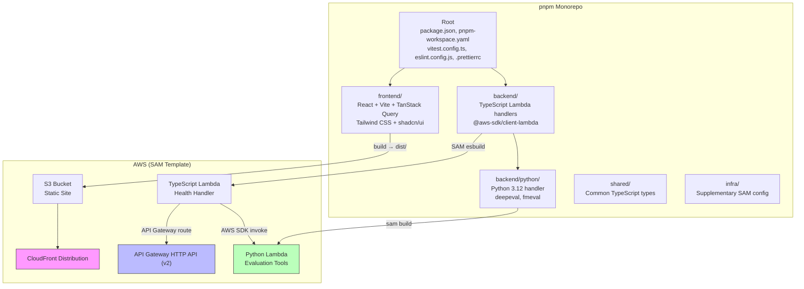
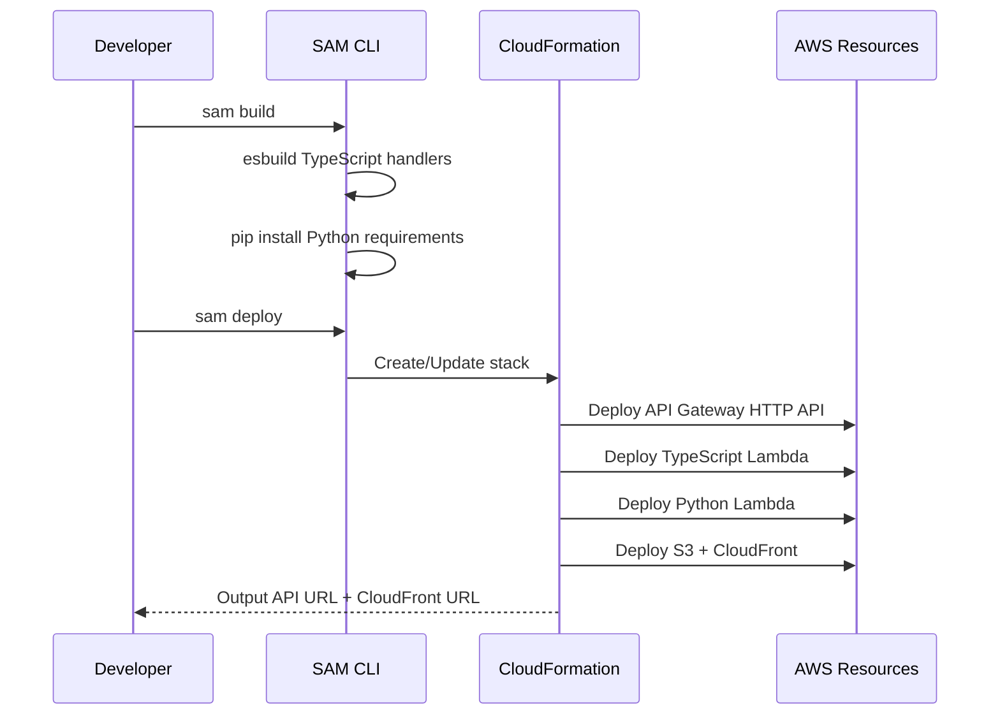

# Design Document: Project Base Setup

## Overview

This design establishes the foundational monorepo structure for the Bedrock Model Evaluation Tool. The project is a pnpm monorepo with two workspaces (`frontend`, `backend`), a standalone Python Lambda directory (`backend/python/`), shared TypeScript configuration, and AWS SAM infrastructure-as-code. The architecture deploys a React SPA via CloudFront + S3, TypeScript Lambda handlers behind API Gateway HTTP API (v2), and a Python Lambda invoked directly by the TypeScript handlers via the AWS SDK.

The design prioritizes a minimal, deployable skeleton that subsequent features build upon. All infrastructure is defined in a single `template.yaml` at the repository root using AWS SAM with CloudFormation resources.

## Architecture



### Deployment Flow



## Components and Interfaces

### 1. Root Monorepo Configuration

**Files:**

- `package.json` — Root package with `"private": true`, root scripts (`dev`, `build`, `test`, `lint`, `format`), and shared devDependencies
- `pnpm-workspace.yaml` — Defines `frontend` and `backend` workspaces
- `tsconfig.json` — Existing root TypeScript config extending `@tsconfig/node24`
- `vitest.config.ts` — Root Vitest config with `vite-tsconfig-paths`
- `eslint.config.js` — Flat ESLint config with `eslint-config-prettier/flat`
- `.prettierrc` — Prettier config with `prettier-plugin-organize-imports`

**Root Scripts:**

```json
{
  "dev": "sam local start-api",
  "build": "pnpm -r build && sam build",
  "test": "vitest run",
  "lint": "eslint .",
  "format": "prettier --write ."
}
```

### 2. Frontend Workspace (`frontend/`)

**Scaffolded via:** `pnpm create vite frontend --template react-ts`

**Key Files:**

- `package.json` — Frontend dependencies (React, TanStack Query, Tailwind CSS)
- `tsconfig.json` — Extends root `tsconfig.json`
- `vite.config.ts` — Vite build configuration
- `src/main.tsx` — Entry point rendering root component with `QueryClientProvider`
- `tailwind.config.js` — Tailwind CSS configuration
- `components.json` — shadcn/ui configuration

**Dependencies:**

- `react`, `react-dom`
- `@tanstack/react-query`
- `tailwindcss`, `@tailwindcss/vite`
- shadcn/ui (initialized via CLI)

**Build Output:** `frontend/dist/` — Static files served by CloudFront + S3

### 3. Backend Workspace (`backend/`)

**Key Files:**

- `package.json` — Backend dependencies
- `tsconfig.json` — Extends root `tsconfig.json`
- `src/handlers/health.ts` — Sample health check Lambda handler

**Dependencies:**

- `@aws-sdk/client-lambda` — For invoking the Python Lambda

**Health Handler Interface:**

```typescript
// backend/src/handlers/health.ts
import { APIGatewayProxyEventV2, APIGatewayProxyResultV2 } from 'aws-lambda';

export const handler = async (
  event: APIGatewayProxyEventV2,
): Promise<APIGatewayProxyResultV2> => {
  return {
    statusCode: 200,
    body: JSON.stringify({ status: 'ok' }),
  };
};
```

### 4. Python Lambda (`backend/python/`)

**Key Files:**

- `handler.py` — Lambda entry point
- `requirements.txt` — Python dependencies (`deepeval`, `fmeval`)

**Handler Interface:**

```python
# backend/python/handler.py
import json

def handler(event, context):
    """Entry point for evaluation Lambda.
    Accepts an event payload and returns structured JSON."""
    return {
        "statusCode": 200,
        "body": json.dumps({"status": "ok", "message": "Evaluation handler ready"})
    }
```

### 5. SAM Template (`template.yaml`)

The SAM template defines all infrastructure at the repository root. Key resources:

**Globals:**

```yaml
Globals:
  Function:
    Timeout: 30
    MemorySize: 256
    Runtime: nodejs20.x
    Architectures:
      - x86_64
```

**Resources:**

| Resource                 | Type                                   | Purpose                                    |
| ------------------------ | -------------------------------------- | ------------------------------------------ |
| `ServerlessHttpApi`      | `AWS::Serverless::HttpApi`             | API Gateway HTTP API (v2) with CORS        |
| `HealthFunction`         | `AWS::Serverless::Function`            | TypeScript health handler with esbuild     |
| `EvalFunction`           | `AWS::Serverless::Function`            | Python 3.12 evaluation Lambda (standalone) |
| `FrontendBucket`         | `AWS::S3::Bucket`                      | S3 bucket for static frontend assets       |
| `FrontendBucketPolicy`   | `AWS::S3::BucketPolicy`                | OAC policy for CloudFront access           |
| `CloudFrontOAC`          | `AWS::CloudFront::OriginAccessControl` | Origin access control for S3               |
| `CloudFrontDistribution` | `AWS::CloudFront::Distribution`        | CDN for frontend static site               |

**TypeScript Lambda (esbuild):**

```yaml
HealthFunction:
  Type: AWS::Serverless::Function
  Properties:
    Handler: src/handlers/health.handler
    CodeUri: backend/
    Environment:
      Variables:
        EVAL_FUNCTION_NAME: !Ref EvalFunction
    Policies:
      - LambdaInvokePolicy:
          FunctionName: !Ref EvalFunction
    Events:
      HealthApi:
        Type: HttpApi
        Properties:
          Path: /health
          Method: GET
          ApiId: !Ref ServerlessHttpApi
  Metadata:
    BuildMethod: esbuild
    BuildProperties:
      Minify: true
      Target: es2022
      Sourcemap: true
      EntryPoints:
        - src/handlers/health.ts
      External:
        - '@aws-sdk/*'
```

**Python Lambda (container image):**

```yaml
EvalFunction:
  Type: AWS::Serverless::Function
  Properties:
    PackageType: Image
    Timeout: 900
    MemorySize: 1024
    Architectures:
      - x86_64
  Metadata:
    Dockerfile: Dockerfile
    DockerContext: backend/python/
    DockerTag: latest
```

The Python Lambda uses a container image (`public.ecr.aws/lambda/python:3.12`) because `deepeval` and `fmeval` are too large for a standard Lambda zip package. SAM builds the Docker image during `sam build` and pushes it to ECR during `sam deploy --resolve-image-repos`.

**CloudFront + S3:**

```yaml
FrontendBucket:
  Type: AWS::S3::Bucket
  Properties:
    BucketEncryption:
      ServerBucketEncryption:
        - ServerSideEncryptionConfiguration:
            SSEAlgorithm: AES256

CloudFrontOAC:
  Type: AWS::CloudFront::OriginAccessControl
  Properties:
    OriginAccessControlConfig:
      Name: !Sub '${AWS::StackName}-oac'
      OriginAccessControlOriginType: s3
      SigningBehavior: always
      SigningProtocol: sigv4

CloudFrontDistribution:
  Type: AWS::CloudFront::Distribution
  Properties:
    DistributionConfig:
      Enabled: true
      DefaultRootObject: index.html
      Origins:
        - Id: S3Origin
          DomainName: !GetAtt FrontendBucket.RegionalDomainName
          OriginAccessControlId: !Ref CloudFrontOAC
          S3OriginConfig:
            OriginAccessIdentity: ''
      DefaultCacheBehavior:
        TargetOriginId: S3Origin
        ViewerProtocolPolicy: redirect-to-https
        AllowedMethods: [GET, HEAD]
        CachedMethods: [GET, HEAD]
        ForwardedValues:
          QueryString: false
      CustomErrorResponses:
        - ErrorCode: 403
          ResponseCode: 200
          ResponsePagePath: /index.html
        - ErrorCode: 404
          ResponseCode: 200
          ResponsePagePath: /index.html
```

**Outputs:**

```yaml
Outputs:
  ApiUrl:
    Description: API Gateway endpoint URL
    Value: !Sub 'https://${ServerlessHttpApi}.execute-api.${AWS::Region}.amazonaws.com'
  CloudFrontUrl:
    Description: CloudFront distribution URL
    Value: !Sub 'https://${CloudFrontDistribution.DomainName}'
```

### 6. Supplementary Infra (`infra/`)

The `infra/` directory holds supplementary SAM configuration files:

- `samconfig.toml` — SAM deployment configuration (stack name, region, capabilities)

## Data Models

This feature is a project scaffolding setup — there are no application-level data models. The key data structures are configuration files and infrastructure definitions:

### Configuration Files

| File                       | Format     | Purpose                                                 |
| -------------------------- | ---------- | ------------------------------------------------------- |
| `package.json` (root)      | JSON       | Monorepo root with scripts and shared devDependencies   |
| `pnpm-workspace.yaml`      | YAML       | Workspace definitions (`frontend`, `backend`)           |
| `tsconfig.json` (root)     | JSON       | Base TypeScript config extending `@tsconfig/node24`     |
| `tsconfig.json` (frontend) | JSON       | Frontend TS config extending root                       |
| `tsconfig.json` (backend)  | JSON       | Backend TS config extending root                        |
| `vitest.config.ts`         | TypeScript | Root Vitest configuration with `vite-tsconfig-paths`    |
| `eslint.config.js`         | JavaScript | Flat ESLint config with Prettier integration            |
| `.prettierrc`              | JSON       | Prettier config with `prettier-plugin-organize-imports` |
| `template.yaml`            | YAML       | AWS SAM infrastructure template                         |
| `infra/samconfig.toml`     | TOML       | SAM deployment configuration                            |

### Lambda Handler Contracts

**TypeScript Health Handler (Request/Response):**

```typescript
// Input: APIGatewayProxyEventV2 (from API Gateway HTTP API v2)
// Output: APIGatewayProxyResultV2
{
  statusCode: 200,
  body: '{"status":"ok"}'
}
```

**Python Evaluation Handler (Event/Response):**

```python
# Input: dict (event payload from AWS SDK Lambda invoke)
# Output: dict
{
    "statusCode": 200,
    "body": "{\"status\": \"ok\", \"message\": \"Evaluation handler ready\"}"
}
```

### Environment Variable Contract

| Variable             | Set By                             | Used By                    | Value                       |
| -------------------- | ---------------------------------- | -------------------------- | --------------------------- |
| `EVAL_FUNCTION_NAME` | SAM Template (`!Ref EvalFunction`) | TypeScript Lambda handlers | Python Lambda function name |

## Correctness Properties

_A property is a characteristic or behavior that should hold true across all valid executions of a system — essentially, a formal statement about what the system should do. Properties serve as the bridge between human-readable specifications and machine-verifiable correctness guarantees._

This feature is primarily a project scaffolding setup. Most acceptance criteria verify that specific files exist with specific content (example-based tests). However, the Lambda handlers have testable behavioral properties.

### Property 1: Health handler always returns 200 with valid JSON body

_For any_ valid API Gateway HTTP API v2 event, invoking the health handler should return an object with `statusCode` equal to `200` and a `body` that is valid JSON containing `{"status": "ok"}`.

**Validates: Requirements 3.3**

### Property 2: Python evaluation handler returns structured response

_For any_ valid event dictionary, invoking the Python evaluation handler should return a dictionary with a `statusCode` key (integer) and a `body` key (valid JSON string).

**Validates: Requirements 4.3**

### Property 3: Vitest path alias resolution

_For any_ import path using the `@shared/*` alias defined in the root `tsconfig.json`, Vitest with `vite-tsconfig-paths` should resolve it to the corresponding file under the `shared/` directory.

**Validates: Requirements 7.2**

## Error Handling

Since this is a project scaffolding feature, error handling is minimal and focused on the Lambda handlers:

### TypeScript Health Handler

- Returns a `200` status with `{"status": "ok"}` for all requests. No error paths in the skeleton handler.
- Future handlers should catch exceptions and return appropriate HTTP error codes (400, 500) with structured error bodies.

### Python Evaluation Handler

- Returns a `200` status with a structured JSON body for all invocations. No error paths in the skeleton handler.
- Future implementations should wrap evaluation logic in try/except and return error details in the response body with appropriate status codes.

### SAM Build/Deploy Errors

- `sam build` failures surface as CLI errors (e.g., missing dependencies, TypeScript compilation errors, Python requirements install failures).
- `sam deploy` failures surface as CloudFormation stack errors visible in the AWS Console or CLI output.
- `sam validate --lint` can be used to catch template syntax errors before deployment.

### Common Development Errors

- Missing `pnpm install` — resolved by running `pnpm install` at root.
- Missing environment variables during local testing — use `sam local start-api --env-vars env.json` with a local env file.

## Testing Strategy

### Dual Testing Approach

This feature uses both unit tests and property-based tests:

- **Unit tests (Vitest):** Verify specific examples — file existence, config content, handler responses for known inputs, edge cases.
- **Property-based tests (fast-check via Vitest):** Verify universal properties across randomly generated inputs — handler response structure invariants.

### Property-Based Testing Configuration

- **Library:** `fast-check` (integrated with Vitest)
- **Minimum iterations:** 100 per property test
- **Tag format:** `Feature: project-base-setup, Property {number}: {property_text}`
- Each correctness property is implemented by a single property-based test

### Unit Test Plan

| Test                                                         | What it verifies         | Criteria      |
| ------------------------------------------------------------ | ------------------------ | ------------- |
| Root package.json has `"private": true`                      | Monorepo config          | 1.1           |
| pnpm-workspace.yaml lists `frontend` and `backend`           | Workspace config         | 1.2           |
| Frontend package.json has TanStack Query dependency          | Frontend deps            | 2.2           |
| Frontend main.tsx contains QueryClientProvider               | Entry point              | 2.7           |
| Frontend tsconfig.json extends root                          | TS config                | 2.5, 6.2      |
| Backend tsconfig.json extends root                           | TS config                | 3.2, 6.3      |
| Backend package.json has @aws-sdk/client-lambda              | Backend deps             | 3.4           |
| backend/python/handler.py exists                             | Python handler           | 4.1           |
| backend/python/requirements.txt lists deepeval and fmeval    | Python deps              | 4.2           |
| template.yaml has SAM Transform declaration                  | SAM template             | 5.1           |
| template.yaml defines HttpApi with /health route             | API Gateway              | 5.2           |
| template.yaml defines CloudFront + S3 resources              | Static site              | 5.3           |
| template.yaml EvalFunction uses python3.12 and has no Events | Standalone Python Lambda | 4.4, 4.5, 5.4 |
| template.yaml passes EVAL_FUNCTION_NAME env var              | Cross-Lambda config      | 5.5           |
| template.yaml has Outputs for API URL and CloudFront URL     | Stack outputs            | 5.6           |
| vitest.config.ts exists and uses vite-tsconfig-paths         | Test config              | 7.1           |
| Root package.json has vitest and vite-tsconfig-paths devDeps | Test deps                | 7.3           |
| .prettierrc exists with organize-imports plugin              | Prettier config          | 8.1, 8.2      |
| eslint.config.js exists with prettier integration            | ESLint config            | 8.3, 8.4      |
| Root package.json has dev, build, test, lint, format scripts | Root scripts             | 9.1–9.5       |

### Property Test Plan

| Test                                                         | Property   | Criteria |
| ------------------------------------------------------------ | ---------- | -------- |
| Health handler returns 200 + valid JSON for random events    | Property 1 | 3.3      |
| Python handler returns structured response for random events | Property 2 | 4.3      |
| Path alias @shared/\* resolves correctly                     | Property 3 | 7.2      |
