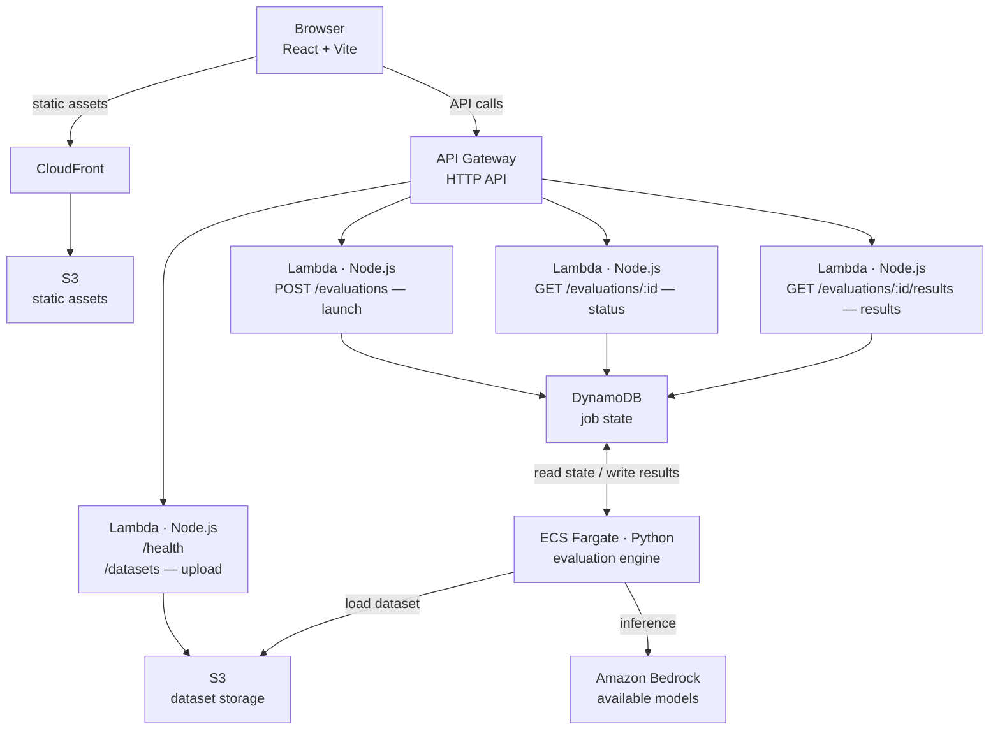

# GenAI Inference Model Evaluation Tool

A serverless tool for benchmarking and comparing Amazon Bedrock models against custom datasets. It measures accuracy, latency, and cost, then produces a weighted recommendation for the best model for your use case.

## Overview

The tool guides users through a four-step workflow:

1. **Set metric weights** — tune how much accuracy, latency, and cost matter for your workload
2. **Select models** — choose which Amazon Bedrock models to evaluate
3. **Upload a dataset** — CSV or JSONL file containing documents and optional reference outputs (summaries or class labels)
4. **Run evaluation and review results** — track progress in real time and get a ranked recommendation with per-model metrics

### Supported task types

| Task           | Dataset format                 | Metrics computed                                           |
| -------------- | ------------------------------ | ---------------------------------------------------------- |
| Summarization  | `document` + `summary` columns | BLEU, ROUGE, METEOR, Levenshtein, BERTScore, G-Eval        |
| Classification | `document` + `label` columns   | Accuracy, Precision, Recall, F1 (macro & weighted), G-Eval |

### Architecture



The Python evaluation engine runs as a Docker container on ECS Fargate. It loads the dataset from S3, calls Bedrock for each model, computes all metrics, and writes results back to DynamoDB. Evaluation jobs time out after 30 minutes; partial results are stored if a timeout occurs.

## Prerequisites

| Tool        | Version | Purpose                       |
| ----------- | ------- | ----------------------------- |
| Node.js     | 24+     | Backend Lambda functions      |
| pnpm        | 10+     | Package manager               |
| Python      | 3.12    | Evaluation engine (local dev) |
| AWS SAM CLI | latest  | Build and deploy              |
| Docker      | latest  | Build the Fargate image       |
| AWS CLI     | v2      | Credentials and ECR login     |

Your AWS credentials must have access to Bedrock, ECR, ECS, S3, DynamoDB, Lambda, API Gateway, CloudFront, and VPC.

## Local stack deployment

### 1. Clone and install dependencies

```bash
git clone <repo-url>
cd genai-inference-model-evaluation-tool
pnpm install
```

### 2. Configure environment variables

```bash
cp .env.example .env
```

Edit `.env`:

```env
STAGE=dev
LOG_RETENTION_IN_DAYS=14
ACCOUNT_ID=<your-aws-account-id>
```

### 3. Add your SAM deployment profile

Add a section to `samconfig.toml` for your username:

```toml
[yourname.deploy.parameters]
stack_name = "genai-inference-model-evaluation-tool-yourname"
s3_prefix  = "genai-inference-model-evaluation-tool-yourname"
resolve_s3 = true
region     = "us-west-2"
capabilities = ["CAPABILITY_IAM", "CAPABILITY_AUTO_EXPAND", "CAPABILITY_NAMED_IAM"]
confirm_changeset = true
tags = "Owner=\"yourname\""
image_repository = "<account-id>.dkr.ecr.us-west-2.amazonaws.com/genai-evaluation"
```

### 4. Deploy the Fargate evaluation engine

The Python evaluation engine runs as a Docker image on ECS Fargate. Build and push it to ECR with:

```bash
bash scripts/deploy-evaluation-engine.sh
```

The script:

- Builds the image for `linux/amd64` (required by Fargate)
- Logs in to ECR using your active AWS credentials
- Tags and pushes two tags: a timestamped build ID and `latest`

`ACCOUNT_ID` is read from `.env`. `AWS_REGION` must be set in your environment (e.g. via `aws-vault exec my-profile -- bash scripts/deploy-evaluation-engine.sh`).

### 5. Deploy the CloudFormation stack

```bash
pnpm deploy:backend
```

This runs `sam build --cached` followed by `sam deploy` using the profile in `samconfig.toml` that matches your `STAGE`. SAM will prompt you to confirm the changeset before applying.

### 6. Configure the frontend

```bash
cp frontend/.env.example frontend/.env
```

Set the API Gateway URL printed at the end of the SAM deploy output:

```env
VITE_API_URL=https://<api-id>.execute-api.us-west-2.amazonaws.com
```

### 7. Start the frontend dev server

```bash
cd frontend
pnpm dev
```

The app is served at `http://localhost:5173`.

See [frontend/README.md](frontend/README.md) for the full frontend setup, available scripts, and testing instructions.

### Running the API locally with SAM

You can run the Lambda functions locally (they still call real AWS services):

```bash
pnpm dev   # runs: sam local start-api
```

Requests to `http://localhost:3000` are routed to the local Lambda runtime. Note that the Fargate evaluation engine cannot run locally — launch evaluations against a deployed stack.

## Testing strategy

The project uses **Vitest** for TypeScript tests and **pytest** for the Python evaluation engine. TypeScript tests are colocated with their modules (`*.test.ts`); Python tests live under `backend/python-eval-function/tests/` (`test_*.py`, one file per source module).

### Running tests locally

```bash
# All TypeScript tests
pnpm test

# Backend TypeScript only
pnpm test:backend

# Scoped TypeScript suites
pnpm test:handlers    # Lambda HTTP adapters
pnpm test:usecases    # Business logic
pnpm test:services    # AWS service integrations

# Python evaluation engine (Fargate worker)
pnpm test:evaluation-worker
```

#### Python evaluation engine setup

The `test:evaluation-worker` script uses a virtual environment at `backend/python-eval-function/.venv`. Create it once before the first run:

```bash
cd backend/python-eval-function
python3.12 -m venv .venv   # must be 3.12 — 3.14 breaks tokenizers (PyO3)
.venv/bin/pip install -r requirements.txt
cd ../..
pnpm test:evaluation-worker
```

To run pytest directly (optional flags such as `-v` or a single file):

```bash
cd backend/python-eval-function
.venv/bin/python -m pytest -v
.venv/bin/python -m pytest tests/test_model_recommender.py -v
```

AWS SDK calls (S3, DynamoDB, Bedrock) and heavy dependencies (G-Eval, BERTScore) are mocked in Python tests so they run without AWS credentials or model downloads.

### CI triggers

Tests run automatically via GitHub Actions (`.github/workflows/tests.yml`):

| Job                   | Trigger                                  | Command                       |
| --------------------- | ---------------------------------------- | ----------------------------- |
| `backend-tests`       | Pull requests; pushes to `main` or `dev` | `pnpm test:backend`           |
| `python-worker-tests` | Pull requests; pushes to `main` or `dev` | `pnpm test:evaluation-worker` |

Both jobs must pass before merging.

### Test layers

| Layer             | Location                                       | What is tested                                                                |
| ----------------- | ---------------------------------------------- | ----------------------------------------------------------------------------- |
| Handlers          | `backend/src/handlers/**/*.test.ts`            | Request parsing, response shaping, error codes                                |
| Use cases         | `backend/src/useCases/**/*.test.ts`            | Business rules, orchestration logic                                           |
| Services          | `backend/src/services/**/*.test.ts`            | DynamoDB, S3, ECS adapter behaviour                                           |
| Parsers           | `backend/src/parsers/**/*.test.ts`             | CSV and JSONL parsing, including property-based tests with `fast-check`       |
| Frontend          | `frontend/src/services/apiService.test.ts`     | API client contract                                                           |
| Evaluation engine | `backend/python-eval-function/tests/test_*.py` | Metrics, dataset loading, Bedrock client, cost, recommendation, orchestration |

TypeScript AWS SDK calls are mocked with Vitest's `vi.mock` so tests run without AWS credentials. Property-based tests use `fast-check` to verify parser invariants across randomly generated inputs.

### Sample datasets

Three sample files are included at the repo root for manual smoke-testing:

- `test-dataset.csv` — summarization task
- `test-dataset.jsonl` — summarization task (JSONL format)
- `test-dataset-classification.csv` — classification task

## Project structure

```
.
├── backend/
│   ├── src/
│   │   ├── handlers/          # Lambda entry points (HTTP adapters)
│   │   ├── useCases/          # Business logic
│   │   ├── services/          # AWS SDK integrations (DynamoDB, S3, ECS)
│   │   ├── parsers/           # CSV / JSONL parsing
│   │   └── models/            # TypeScript interfaces
│   └── python-eval-function/  # Fargate evaluation engine
│       ├── src/               # Python source
│       │   ├── main.py
│       │   ├── bedrock_client.py
│       │   ├── accuracy_evaluator.py
│       │   ├── classification_evaluator.py
│       │   ├── geval_evaluator.py
│       │   ├── cost_calculator.py
│       │   └── model_recommender.py
│       ├── tests/             # pytest suite (test_*.py)
│       ├── Dockerfile
│       ├── pytest.ini
│       └── requirements.txt
├── frontend/                  # React 19 + Vite + Tailwind (see frontend/README.md)
│   └── src/
│       ├── components/evaluator/  # Step components for the evaluation workflow
│       ├── components/ui/         # Reusable UI primitives
│       ├── hooks/                 # useEvaluation orchestration hook
│       ├── pages/                 # Index (main stepper) and NotFound
│       ├── services/              # Typed API client + contract tests
│       └── types/                 # Shared TypeScript interfaces
├── infrastructure/
│   ├── api.yaml               # Lambda functions + API Gateway
│   └── network.yaml           # VPC, subnets, security groups
├── shared/                    # Shared TypeScript types
├── template.yaml              # Root SAM / CloudFormation template
├── samconfig.toml             # Per-developer deployment profiles
└── vitest.config.ts           # Test runner configuration
```
